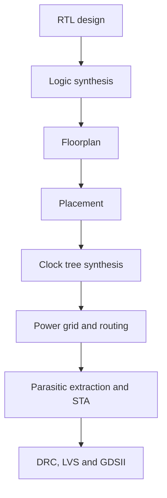

# Digital VLSI SoC Design and Planning — RTL to GDSII
This repository documents the transformation of the **PicoRV32A RISC-V core** from synthesizable RTL into a fabrication-ready GDSII layout. It combines physical-design theory, reproducible OpenLane labs, custom-cell characterization, timing analysis, and practical debugging into one continuous engineering narrative.

## Why this repository is different

Physical design is easier to understand when every concept is connected to an action and every action leaves evidence. Each stage in this repository therefore follows four questions:

| Lens | Question |
|---|---|
| **Concept** | What physical-design problem are we solving? |
| **Action** | Which command or tool performs the work? |
| **Evidence** | Which report, waveform, DEF, LEF, or layout proves the result? |
| **Insight** | What should an engineer verify before moving forward? |

The goal is not merely to complete the flow, but to understand how early design decisions affect area, timing, power, congestion, and manufacturability later.

---

## The silicon journey

| Stage | Primary question | Main artifact |
|---|---|---|
| RTL | Does the logic describe the intended behavior? | Verilog source |
| Synthesis | Can the logic be mapped to real cells? | Gate-level netlist |
| Floorplan | Can the design fit and connect efficiently? | Floorplan DEF |
| Placement | Where should each standard cell be located? | Placement DEF |
| CTS | Can the clock reach sequential cells with controlled skew? | CTS netlist/DEF |
| Routing | Can every net be physically connected? | Routed DEF |
| Sign-off | Is the design timed, legal, and manufacturable? | Reports and GDSII |

---

## Workshop roadmap

- [Day 1 - Introduction to Open-Source ASIC Design, OpenLane and Sky130 PDK](#day-1) 

- [Day 2 - Chip Floorplanning, Library Cells and Standard Cell Placement](#day-2)

- [Day 3 - Design and Characterization of Standard Cells using Magic and ngspice](#day-3)

- [Day 4 - Pre-Layout Timing Analysis and Clock Tree Synthesis](#day-4)

- [Day 5 - Final RTL to GDSII Flow: Power Distribution, Routing and Post-Route Timing Analysis](#day-5)

- [Tools & Environment](#tools-environment)
  
- [Key Learnings](#key-learnings)
 
- [Acknowledgements](#acknowledgements)

- [References](#references)

---

## Toolchain

| Tool | Role in the flow |
|---|---|
| **OpenLANE** | Orchestrates the RTL-to-GDSII flow |
| **Yosys** | RTL synthesis |
| **ABC** | Technology mapping and logic optimization |
| **OpenROAD** | Floorplanning, placement, CTS, PDN, and routing |
| **Magic** | Layout viewing, extraction, and DRC |
| **ngspice** | Transistor-level simulation |
| **OpenSTA** | Static timing analysis |
| **Netgen** | Layout-versus-schematic comparison |
| **SKY130A PDK** | Process rules, device models, and cell libraries |

---

## Day 1 - Introduction to Open-Source ASIC Design, OpenLane and Sky130 PDK

The OpenLane framework integrates multiple open-source EDA tools into a single automated ASIC implementation flow.

  
   
  <em>Figure 1: OpenLane_design_flow.png layout</em>

--- 

## Day 2 - Chip Floorplanning, Library Cells and Standard Cell Placement

Day 2 content goes here.

---

## Day 3 - Design and Characterization of Standard Cells using Magic and ngspice

Day 3

---

## Day 4 - Pre-Layout Timing Analysis and Clock Tree Synthesis

Day 4

--- 

## Day 5 - Final RTL to GDSII Flow: Power Distribution, Routing and Post-Route Timing Analysis

Day 5

--- 

## Tools & Environment

--- 

## Key Learnings

--- 

## Acknowledgements

--- 

## References

